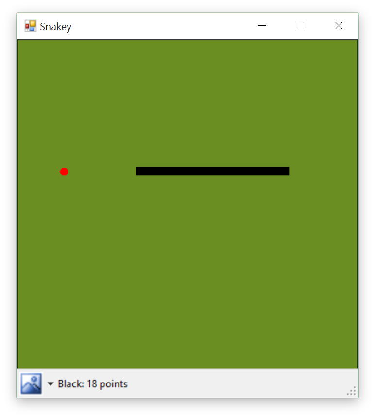
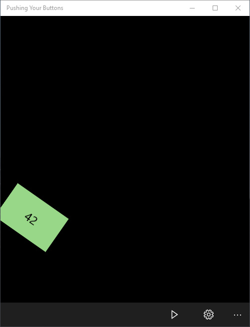

# general
Selected assignments, and code I've done in my free time.  

## Snake

Classic Snake game with two-player support.  

* C# - Windows Forms Application
* Final project for Whitereia STAR Course (PP590 C#), 2013

## Pushing Your Buttons

Hit the button as much as you want (or can).

* C# and XAML - Windows 10 Universal App
* Created as part of the Microsoft Student Accelerator programme (final Phase 1 project)
* 3 Modes - Zen, Timed, Challenge